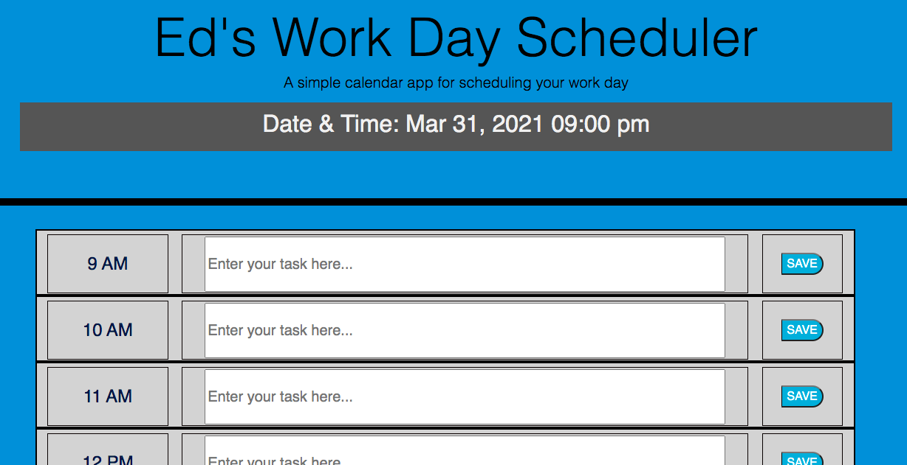

# Student Work Day Scheduler
 
## Description
This webpage was created so a user could enter in a task they would like completed at some hour of the work day. Color prompts allow the user to better manage their tasks so they know what is past-due. 

They can save the task, by clicking the SAVE button, and it will store locally so it shows up each time they open the webpage.

Once the task it done, they can clear it from local storage but clicking the DONE button. The can then enter a new task and repeat the SAVE process.  
 
## Table of Contents
- [Installation](#installation)
- [Criteria Checks](#criteria)
- [Usage and Coding](#Usage/coding)
- [Screenshots](#screenshots)
- [Credits](#credits)
- [License](#license)
## Installation
Clone or download this repository on GitHub then open "edoliva.github.io/StudentScheduler/index.html" in a browser.  
## Criteria
- The user must enter some text in the task box or they will receive an error when they try press the SAVE button for that time slot.
- The user can leave a time slot open without receiving an error alert.   
- If the user would like to clear the time slot the will press the DONE button. 
## Usage/coding:
- This HTML, CSS and JS were written to allow for a clean user experience. The general logic is as follows:
   - The top of the webpage shows the date and current time. As the user scrolls down the Date/Time header will stick to the top of the page.
   - Each row represents one hour of a standrd work day. As the hours pass, the row will turn grey; when in the current hour, the row will turn red; and when the hour is in the future the row will turn green. 
   - The middle section of each row is an open text box for the user to type in the task. Only when they hit SAVE will the task save to local storage. The SAVE button will switch to "display:none" and the DONE button will switch to "display:inline-block". The input box will also "display:none" and the locally stored task will "display:inline-block".
   - When the user clicks the DONE button, all of these styling displays will reverse so the user is only presented with the SAVE button and the input box.
 
## Screenshots

Header and Time Bar Stick
-

-

-
Color Rows and Button Function

-

-

-
If user leaves task blank, but clicks SAVE button:
-

-
 
## Credits
Shoutout to our instructor Anthony and TA Tom! As well as everyone at Trilogy Education for making the content and grading our assignments.
 
## License
© 2021 Edmond Oliva.
Confidential and Proprietary. All Rights Reserved.
---
